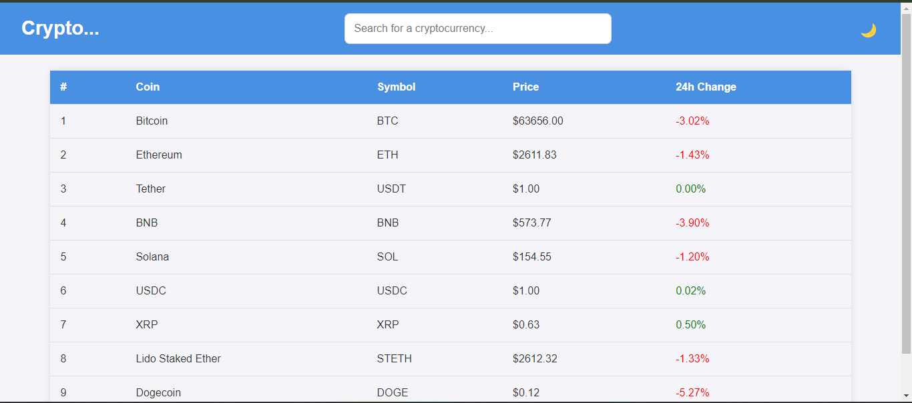

# Crypto Price Tracker

A modern, fully responsive web app to track cryptocurrency prices in real-time. This app provides a clean and dynamic user interface, powered by HTML, CSS, and JavaScript. It fetches live crypto data from an external API and displays it in a table that adapts to different screen sizes, ensuring accessibility on all devices.

## Features

- **Real-time Crypto Data**: Live updates of cryptocurrency prices, including name, symbol, current price, and percentage change in the last 24 hours.
- **Search Functionality**: Easily search for specific cryptocurrencies.
- **Responsive Design**: Fully responsive layout for both mobile and desktop devices.
- **Dark Mode**: Toggle between light and dark mode for a visually comfortable experience.
- **Table Sorting**: Sort cryptocurrencies by rank, name, or price.

## Tech Stack

- **Frontend**: HTML, CSS, JavaScript
- **API**: Fetches data from the [CoinGecko API](https://www.coingecko.com/en/api)
- **Styling**: Modern responsive CSS design with media queries for mobile-first approach.

## Demo

You can view the live app [here](https://ajay-dhangar.github.io/crypto-price-tracker/).

## Screenshots

### Desktop View


### Mobile View


## Installation

To run this project locally, follow the steps below:

### 1. Clone the repository

```bash
git clone https://github.com/your-username/crypto-price-tracker.git
```

### 2. Navigate to the project directory

```bash
cd crypto-price-tracker
```

### 3. Open `index.html` in your preferred browser

You can directly open the `index.html` file in a browser or use a local server like [Live Server](https://marketplace.visualstudio.com/items?itemName=ritwickdey.LiveServer) if you're using VSCode.

## Usage

1. Open the app in your browser.
2. Use the search bar to find specific cryptocurrencies.
3. View real-time price updates, percentage change, and more.
4. Toggle between **Light** and **Dark** mode using the switch in the header.
5. The app adapts to your device's screen size automatically (responsive design).

## How It Works

- The app fetches data from the [CoinGecko API](https://www.coingecko.com/en/api) using JavaScript's `fetch` method.
- Data is displayed in a dynamically generated table.
- Responsive design ensures a smooth experience on all devices, with mobile-friendly features like stacked rows for smaller screens.
- The dark mode is controlled via JavaScript by toggling a `.dark` class on the `body`.

## Code Structure

```
crypto-price-tracker/
├── index.html         # Main HTML file
├── style.css          # Custom CSS for styling
├── script.js          # Main JavaScript file for fetching and displaying data
└── README.md          # Project documentation
```

### Key Files:

- **`index.html`**: Contains the structure and layout of the app.
- **`style.css`**: Contains all the styles, including responsive design and dark mode.
- **`script.js`**: Contains the JavaScript code that fetches data from the API and dynamically updates the DOM.

## API Reference

This project uses the [CoinGecko API](https://www.coingecko.com/en/api) to fetch live cryptocurrency prices and data.

### Example API Call

```bash
https://api.coingecko.com/api/v3/coins/markets?vs_currency=usd
```

## Contributing

Feel free to contribute to the project! Here’s how you can get started:

1. Fork the repository.
2. Create a new branch (`git checkout -b feature-branch-name`).
3. Make your changes.
4. Commit your changes (`git commit -m 'Add some feature'`).
5. Push to the branch (`git push origin feature-branch-name`).
6. Create a pull request.

## License

This project is licensed under the MIT License - see the [LICENSE](LICENSE) file for details.

## Acknowledgements

- [CoinGecko API](https://www.coingecko.com/en/api) for providing free access to crypto data.
- [Font Awesome](https://fontawesome.com/) for icons.